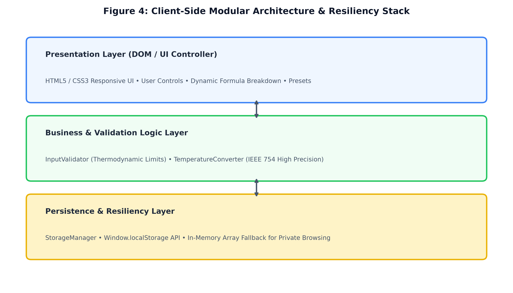
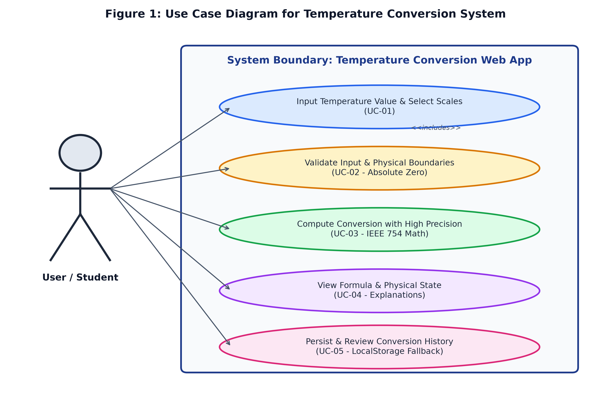
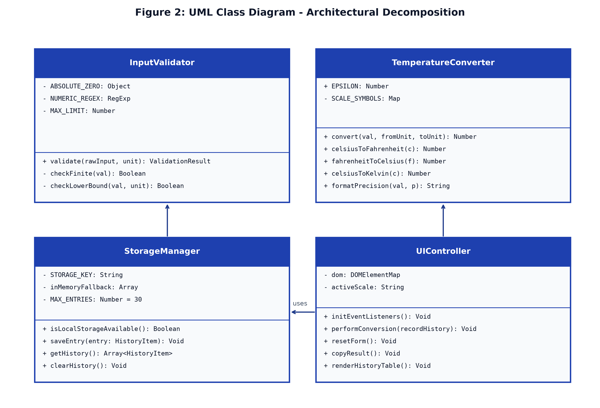
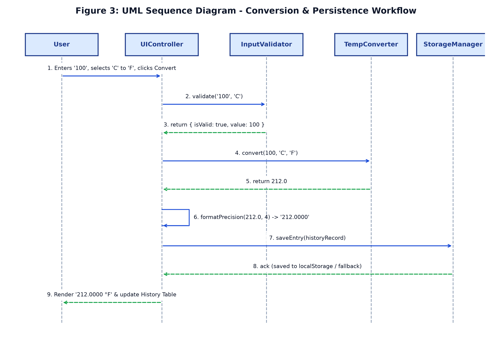

# Temperature Conversion System

A modern, high-precision scientific temperature conversion web application designed for students, researchers, and engineers. Built with standard web technologies (HTML5, CSS3, ES6+ JavaScript), this system delivers accurate bidirectional conversions across the three primary thermodynamic scales: **Celsius (°C)**, **Fahrenheit (°F)**, and **Kelvin (K)**, with strict enforcement of thermodynamic physical limits and stabilization against IEEE 754 floating-point drift.

---

## ✨ Features

- **High-Precision Conversion Engine:** Computes conversions across Celsius, Fahrenheit, and Kelvin with scalable decimal precision (2, 4, 6, 8 decimal places, or full raw precision) and IEEE 754 floating-point stabilization.
- **Thermodynamic Limit Enforcement:** Enforces Absolute Zero physical boundaries ($-273.15^\circ\text{C}$, $-459.67^\circ\text{F}$, $0\text{ K}$) and prevents physically impossible temperature entries.
- **Step-by-Step Mathematical Explanations:** Dynamically breaks down each calculation into human-readable intermediate mathematical steps for educational clarity.
- **Thermal Milestone Indicators:** Real-time environmental feedback classifying entered temperatures (Absolute Zero, Freezing, Ambient/Room Temp, Human Body Temp, Boiling Point, Superheated).
- **Session & LocalStorage History:** Logs conversion history with timestamps and status indicators, featuring automatic in-memory fallback for private/sandboxed browser environments.
- **Interactive Utility Controls:** One-click scale inversion (swap), quick physical preset chips ($0^\circ\text{C}$, $100^\circ\text{C}$, $37^\circ\text{C}$, $0\text{ K}$), and clipboard copying.
- **Zero External Dependencies:** Built entirely with vanilla client-side web technologies. Runs locally in any modern browser without build tools or package managers.

---

## 📐 Scientific Conversion Model

The conversion engine utilizes canonical thermodynamic transformation models:

| From Scale | To Scale | Mathematical Formulation |
| :--- | :--- | :--- |
| **Celsius** | **Fahrenheit** | $F = (C \times \frac{9}{5}) + 32$ |
| **Fahrenheit** | **Celsius** | $C = (F - 32) \times \frac{5}{9}$ |
| **Celsius** | **Kelvin** | $K = C + 273.15$ |
| **Kelvin** | **Celsius** | $C = K - 273.15$ |
| **Fahrenheit** | **Kelvin** | $K = (F - 32) \times \frac{5}{9} + 273.15$ |
| **Kelvin** | **Fahrenheit** | $F = (K - 273.15) \times \frac{9}{5} + 32$ |

---

## 🏗️ Architecture & UML Models

The application implements a decoupled, client-side MVC-inspired architecture divided into distinct layers:

1. **Presentation Layer:** Semantic HTML5 and responsive CSS3 UI with ARIA accessibility.
2. **Business & Validation Logic:** 
   - `InputValidator`: Multi-stage parsing, finite real number check, and thermodynamic lower-bound enforcement.
   - `TemperatureConverter`: Direct transformation routines with scaled epsilon rounding.
   - `FormulaExplainer`: Dynamic derivation and physical classification generation.
3. **Persistence Layer:**
   - `StorageManager`: Resilient local storage persistence with automatic quota detection and in-memory fallback.

### System Architecture


### Use Case Diagram


### Class Diagram


### Sequence Diagram


---

## 📁 Repository Structure

```
temperature-conversion-system/
├── diagrams/
│   ├── use_case_diagram.png          # UML Use Case Diagram
│   ├── class_diagram.png             # UML Class Diagram
│   ├── sequence_diagram.png          # UML Sequence Diagram
│   └── system_architecture.png       # Layered Architecture Diagram
├── prototype/
│   ├── index.html                    # Interactive Web Application UI
│   ├── styles.css                    # Responsive Styling & Layout
│   ├── converter.js                  # Core Modules (Validator, Converter, Storage)
│   ├── tests.html                    # In-Browser Visual Unit Test Runner
│   └── test_runner.js                # Command-Line Automated Unit Tests
├── build_milestone_2_report.py       # Automated Report Generator Script
├── generate_diagrams.py              # Matplotlib UML Generator Script
└── README.md                         # Project Documentation
```

---

## 🚀 Getting Started

### 1. Run the Web Application
No installation or server setup is required:
1. Clone the repository:
   ```bash
   git clone https://github.com/B1tBr34k3r/temperature-conversion-system.git
   ```
2. Open `prototype/index.html` directly in your web browser (Chrome, Firefox, Safari, Edge).

### 2. Run Automated Verification Tests

- **In the Browser:** Open `prototype/tests.html` to run interactive visual assertions.
- **From Command Line (Node.js):**
  ```bash
  node prototype/test_runner.js
  ```

---

## 🧪 Quality Assurance & Test Matrix

The project includes an automated test suite comprising 30 assertions covering:
- **Input Validation:** Rejection of empty strings, whitespace, malformed tokens, and non-numeric characters.
- **Physical Boundary Enforcement:** Acceptance of exact Absolute Zero ($-273.15^\circ\text{C}$, $-459.67^\circ\text{F}$, $0\text{ K}$) and strict rejection of sub-Absolute Zero values.
- **Scientific Reference Benchmarks:** Freezing points, boiling points, and intersection convergence ($-40^\circ\text{C} = -40^\circ\text{F}$).
- **Round-Trip Symmetry:** Reversible mathematical transformations ($C \rightarrow F \rightarrow C$ and $C \rightarrow K \rightarrow C$) with zero precision loss ($\le 10^{-9}$).

---

## 🗺️ Project Roadmap

- [x] **Milestone 1:** Requirement Analysis & Architectural Design.
- [x] **Milestone 2:** Core Module Implementation, Floating-Point Precision, Thermodynamic Validation & Prototyping.
- [ ] **Milestone 3:** Advanced Modular Scales (Rankine, Delisle, Réaumur) & History Export (CSV/JSON).
- [ ] **Milestone 4:** Data Visualization (Live Comparison Graphs & Canvas Charts).
- [ ] **Milestone 5:** Progressive Web App (PWA) Offline Support & Production Packaging.

---

## 👥 Authors

- **Prakhar Harne**
- **Naman Shrivastav**
